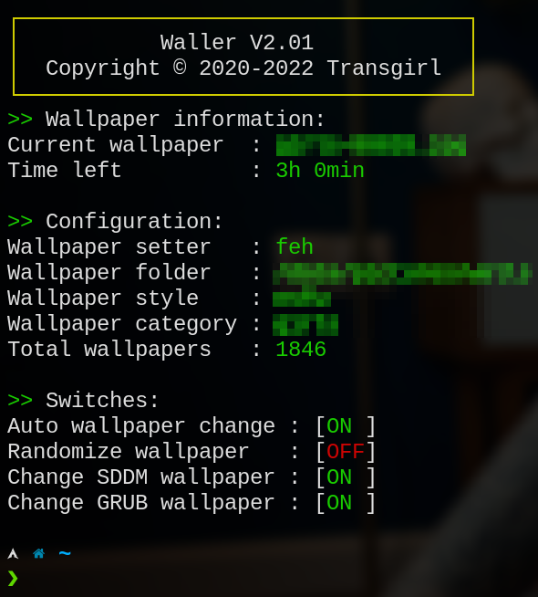

# Waller
_a simple wallpaper changer written in python_

## Why waller?
First of all I wanted a simple script to change the wallpapers on my system,
using BSPWM. I first had some simple bash scripts which enabled me to change
the wallpapers using _nitrogen_. But as my desire to go simpler and leaner I
changed to using _feh_.

Then I wanted to have the wallpapers change automatically and I found using
systemctl a good way to do that, but I got tired of typing those long commands
when I wanted the automatic changing to stop.

That's when I first started to collect everything I wanted in one script and
found it easier to write it in Python than in Bash or Zsh.

That's how _waller_ was born.

## Installation
Provided is a sample config file for waller. Please change everything needed,
like _/path/to/waller_ for instance. This script will NOT work without the
config file of without editing the config file.

Furthermore examples of systemctl user scripts to automatically chance the
wallpaper on regular intervals are provided. You can simply copy the folders
contained in _config_ to _.config_ in your home directory.

## Warranty
The files are provided as is and I am not responsible for any damages done to
your system by the usage of these scripts.

*USE OF THESE SCRIPTS IS TOTALLY ON YOUR OWN RISK*
